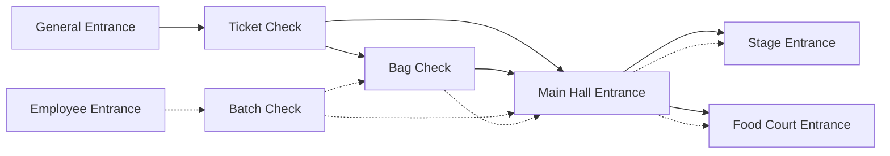
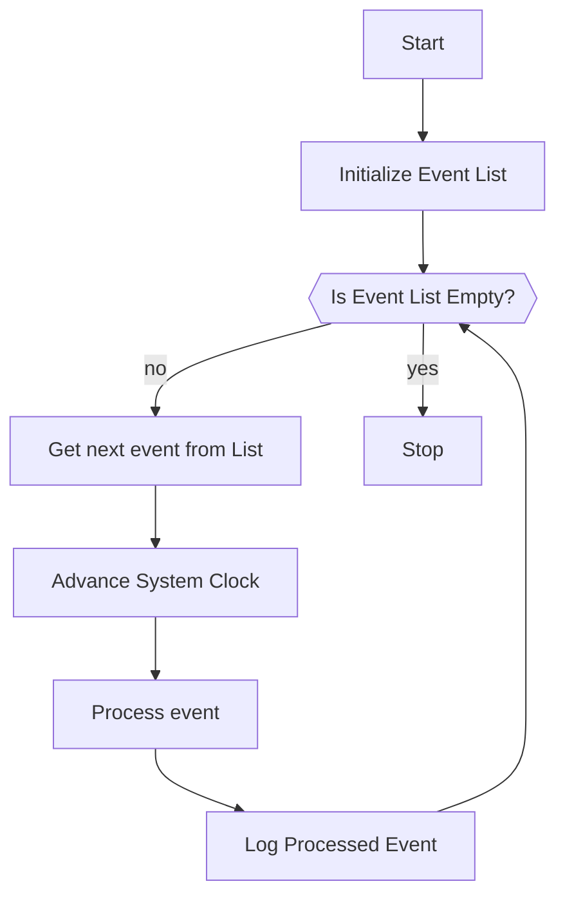
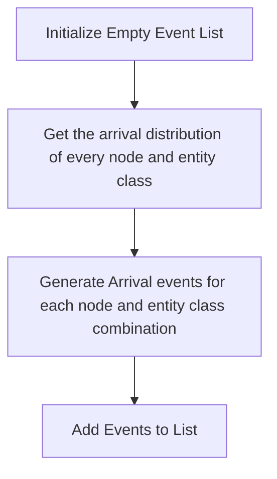
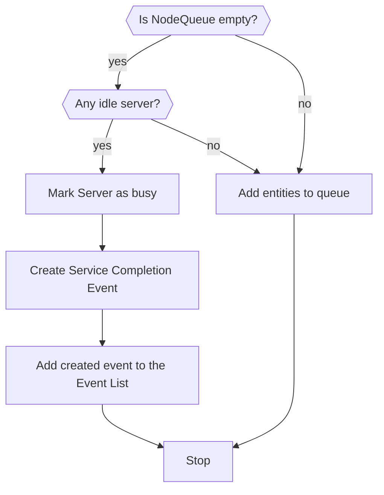
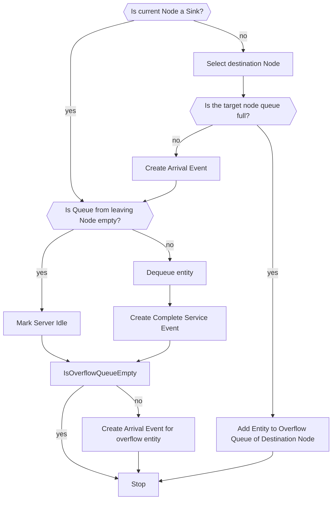

# QueueSharp

A C# library for simulating discrete event systems with a focus on modeling complex queuing systems. It provides tools for constructing, analyzing, and optimizing queues and service nodes, allowing for flexible routing, performance measurement, and system behavior tracking.

## Example network

This network illustrates the flow of attendees entering a large event. There are two entrances: a General Entrance and an Employee Entrance, each leading to different checks like Ticket, Bag, or Batch checks. After completing the necessary checks, attendees can proceed to different areas such as the Main Hall, Stage, or Food Court, depending on their route.

# Algorithm

## Initialize Event List

## Process event

Process the event based on it's type.

### Arrival Event

Input:

- Entity Class
- Number of arriving entities
- Node

### Complete Service Event

