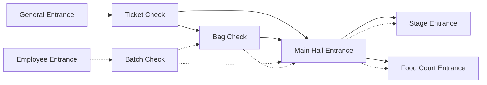
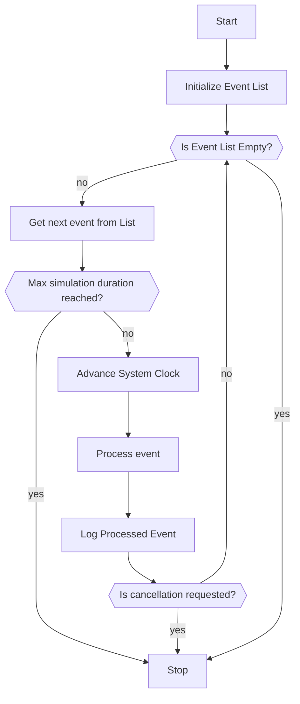
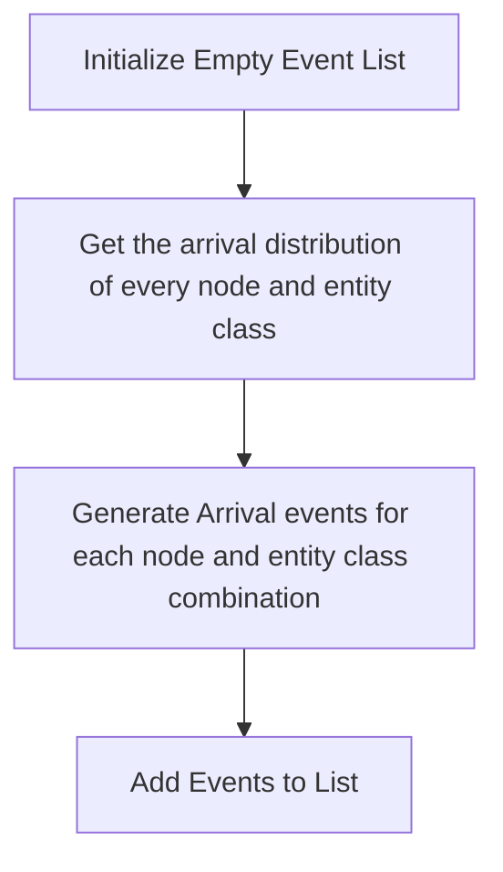
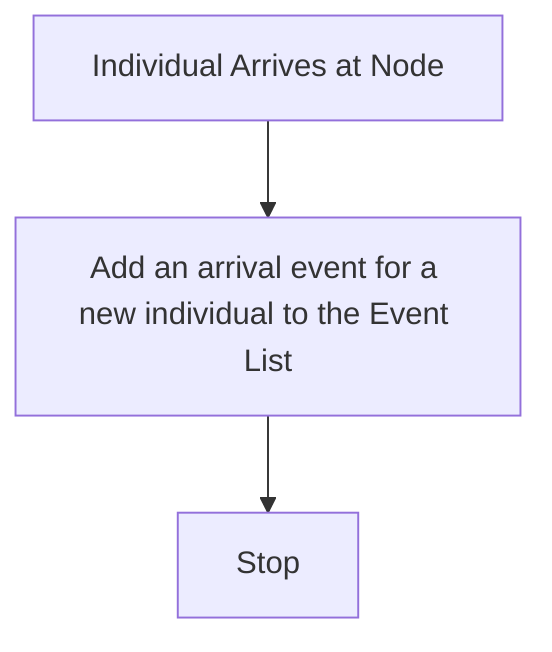
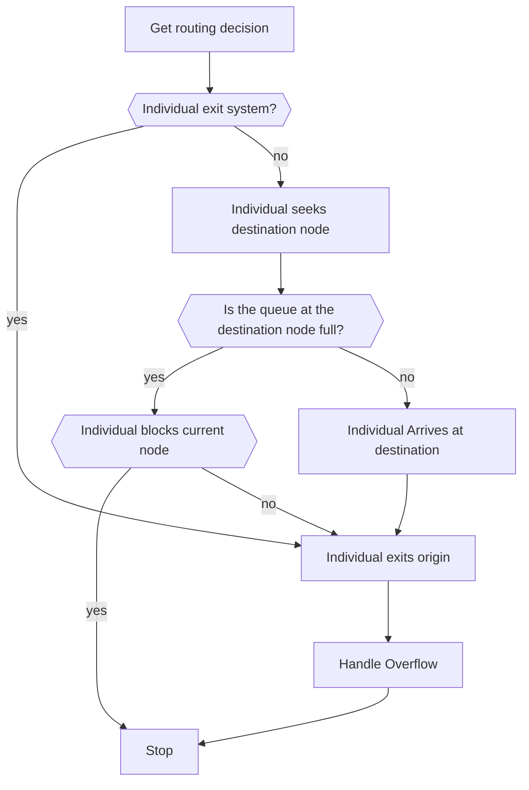
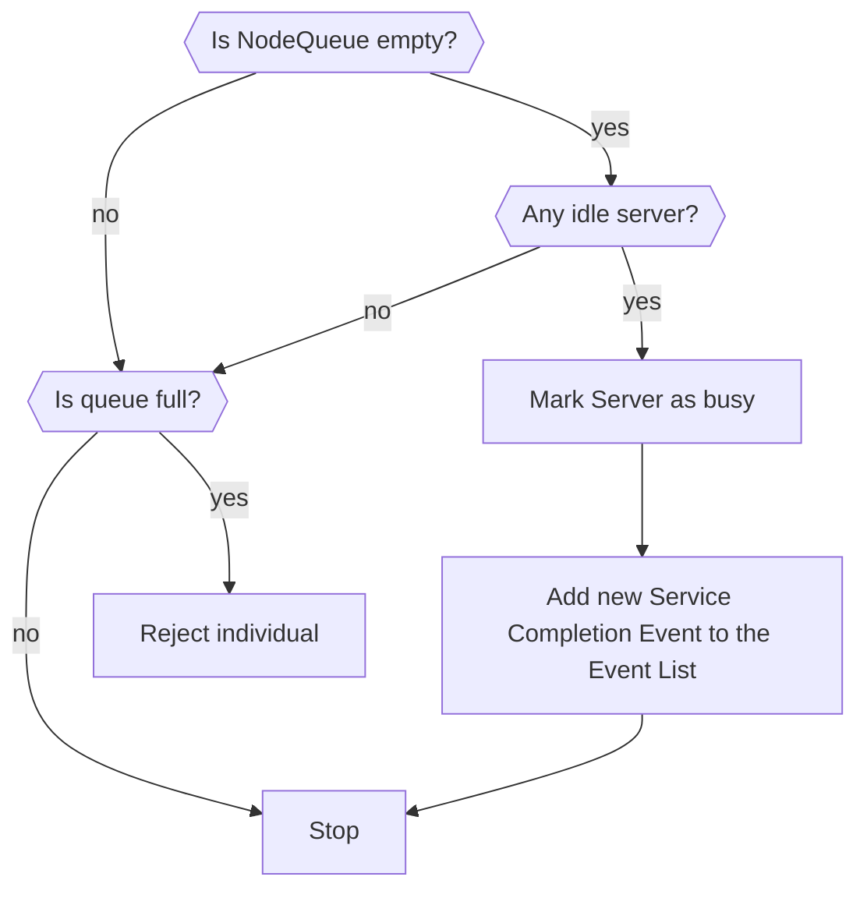
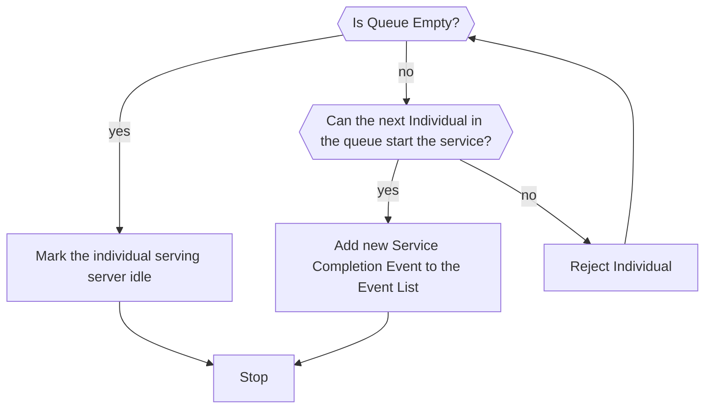
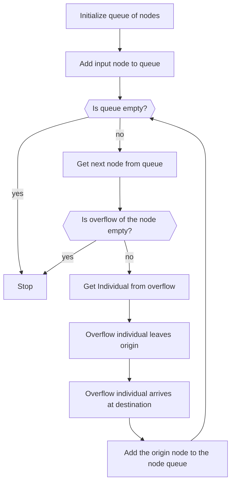

# QueueSharp

A C# library for simulating discrete event systems with a focus on modeling complex queuing systems. It provides tools for constructing, analyzing, and optimizing queues and service nodes, allowing for flexible routing, performance measurement, and system behavior tracking.

## Example network

This network illustrates the flow of attendees entering a large event. There are two entrances: a General Entrance and an Employee Entrance, each leading to different checks like Ticket, Bag, or Batch checks. After completing the necessary checks, attendees can proceed to different areas such as the Main Hall, Stage, or Food Court, depending on their route.

# Algorithm

This section describes how the discrete event simulation to handle queuing is implemented.

- **Initialize Event List**: [Details](#initialize-event-list)
- **Process event**: [Details](#process-event)

## Initialize Event List

## Process event

Process the event based on it's type.

### Arrival Event

- **Individual Arrives at Node**: [Details](#individual-arrives-at-node)
- **Add an arrival event for a new individual to the Event List**: Arrival events are generated whenever an individual arrives at a node. For example, when Individual A arrives at a node, the system determines a random time interval before scheduling the arrival of the next individual (e.g., Individual B) at the same node. This process ensures a continuous flow of arrivals based on random durations.

### Complete Service Event

- **Individual Arrives at destination**: [Details](#individual-arrives-at-node)
- **Individual exits origin**: [Details](#individual-leaves-node)
- **HandleOverflow**: [Details](#handle-overflow-for-node)

## Shared methods

### Individual Arrives at Node

### Individual leaves node

### Handle Overflow for node

- **Get Individual from overflow**: If an individual blocks an origin node and wishes to go to a destination node with a full queue, it is stored as an overflow individual at the destination node.
- **Overflow individual leaves origin**: [Details](#individual-leaves-node)
- **Overflow individual arrives at destination**: [Details](#individual-arrives-at-node)